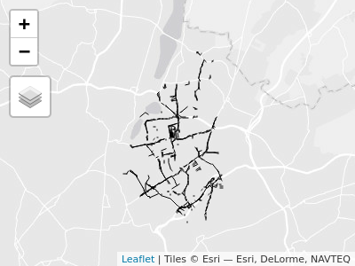

# CycleInfraLnd

The goal of this CycleInfraLnd R package is to download data from the
Transport for London Cycling Infrastructure Database and import it into
R as spatial data (Simple features).

The Cycling Infrastructure Database contains the following assets that
are either lines(l) or points(p):

-   Advanced Stop Line (l)

-   Crossing (l)

-   Cycle lane/track (l)

-   Restricted Route (l)

-   Cycle Parking (p)

-   Restricted Point (p)

-   Signage (p)

-   Signal (p)

-   Traffic Calming (p)

More information on the CID can be found
[here](https://data.london.gov.uk/dataset/cycling-infrastructure-database)
and in this [TFL
blog](https://blog.tfl.gov.uk/2019/08/13/data-drop-cycling-infrastructure-database/).

The [Database
Schema](https://cycling.data.tfl.gov.uk/CyclingInfrastructure/documentation/cid_database_schema.xlsx),
[Asset Information
Guide](https://cycling.data.tfl.gov.uk/CyclingInfrastructure/documentation/asset_information_guide.pdf)
and
[README](https://cycling.data.tfl.gov.uk/CyclingInfrastructure/documentation/CIDASSETS_README.docx)
provide important and useful information about the content of the
database and how it was collected.

## Installation

You can install the developed version of CycleInfraLnd from
[Github](https://github.com/PublicHealthDataGeek/CycleInfraLnd) with:

``` r
#install.packages("devtools")
devtools::install_github("PublicHealthDataGeek/CycleInfraLnd")
```

## Examples

These examples show the two functions in this package that allow you to
obtain either lines or points from the Cycling Infrastructure Database.
The example list in the help file contains all variations of this code
for each of the different asset types i.e. the different lines and
points that are available in the Cycling Infrastructure Database.

``` r
library(CycleInfraLnd)
?get_cid_lines
cid_asl = get_cid_lines(type = "advanced_stop_line")
cid_cycle_lanes = get_cid_lines(type = "cycle_lane_track")

cid_signal = get_cid_points(type = "signal")
```

``` r
library(dplyr)
#> 
#> Attaching package: 'dplyr'
#> The following objects are masked from 'package:stats':
#> 
#>     filter, lag
#> The following objects are masked from 'package:base':
#> 
#>     intersect, setdiff, setequal, union
london_boroughs = spData::lnd
waltham = london_boroughs %>% 
  filter(NAME == "Waltham Forest")
cid_cycle_lanes_waltham = cid_cycle_lanes[waltham, , op = sf::st_within]
library(tmap)
tmap_mode("view")
#> tmap mode set to interactive viewing

tm_shape(cid_cycle_lanes_waltham) +
  tm_lines()
```



## Publications

The CycleInfraLnd package has been used in the following academic
papers:

-   Tait C, Beecham R, Lovelace R, Barber S. 2022. Is cycling
    infrastructure in London safe and equitable? Evidence from the
    cycling infrastructure database. Journal of Transport and Health.
    <https://doi.org/10.1016/j.jth.2022.101369>

-   Beecham, R., Tait, C., Lovelace, R. and Yang, Y. 2022. Connected
    bikeability in London: which localities are better connected by bike
    and does this matter?. Available from: osf.io/gbfz8 Code available
    at: <https://github.com/rogerbeecham/connected-bikeability-london>
